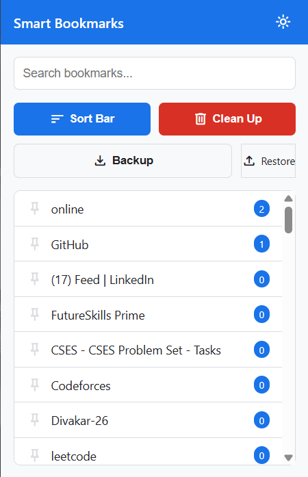
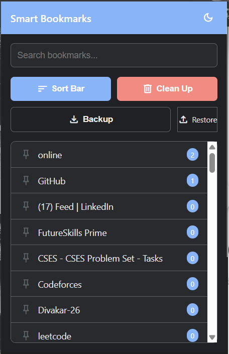

#  Advanced Smart Bookmarks Manager

A modern, algorithmic approach to keeping your Chrome bookmarks clean, secure, and genuinely useful.

##  The "Why" Behind the Project
We have all been there: saving hundreds of bookmarks with good intentions, only to let them gather dust in a cluttered browser menu. Finding what you need becomes impossible, and dead links pile up. 

I built the **Advanced Smart Bookmarks Manager** to solve this exact problem. It doesn't just store links—it actively learns which ones you use, forgives your typos when you search, audits your security, and automatically takes out the trash. 

##  Key Features

*  Intelligent Sorting (Usage Tracking)** 
  Using a background Service Worker, the extension silently tracks your actual browsing habits. The sites you click the most are automatically bubbled to the top of your list.
*  Forgiving "Fuzzy" Search** 
  Built with the **Levenshtein Distance algorithm**, the search bar understands typos. If you search for "githbu", it knows you mean "github" and fetches the right bookmark instantly.
*  Cyber Security Auditor** 
  The extension scans your bookmark tree as it renders and visually flags outdated, unencrypted `http://` links with a warning badge to keep your browsing secure.
*  Automated Garbage Collection** 
  Say goodbye to digital hoarding. A custom 12-month timestamp algorithm calculates inactivity and allows you to permanently sweep away old, unused, and unpinned bookmarks.
*  Cloud Sync & JSON Backups** 
  Powered by `chrome.storage.sync`, your data effortlessly travels with you across devices. Prefer local control? Export and import your entire database as a JSON file with one click.
*  Native Dark Mode** 
  A sleek, CSS-variable-driven interface that remembers your preference. 

##  Interface Previews

| Light Mode | Dark Mode |
| :---: | :---: |
|  |  |

##  Tech Stack & Architecture

* **Frontend:** HTML5, CSS3, ES6 JavaScript (Modules, Async/Await)
* **Browser API:** Chrome Extensions API (Manifest V3)
* **Algorithmic Logic:** Dynamic Programming (Levenshtein Distance)
* **Data Management:** Chrome Storage Sync API, JSON Blob Serialization

##  Installation (Local Development)

Because this is a custom developer tool, you can load it directly into your browser without needing the Chrome Web Store!

1. Clone this repository to your local machine:
   ```bash
   git clone [https://github.com/AkshatSingh-90056/Advanced-bookmarks-extension.git](https://github.com/AkshatSingh-90056/Advanced-bookmarks-extension.git)
   ```

## How to use it 

1. Open Google Chrome and navigate to chrome://extensions/.

2. Toggle Developer mode ON (top right corner).

3. Click the Load unpacked button (top left corner).

4. Select the main folder where you cloned this repository.

5. Pin the extension to your toolbar and enjoy a cleaner browser!

## Project Structure

```text
Advanced-bookmarks-extension/
├── src/
│   ├── img/
│   │   ├── Dark_mode.png
│   │   └── Light_mode.png
│   ├── background.js       # Background service worker for cross-tab tracking
│   ├── data.js             # Modular database controller for Chrome APIs
│   ├── popup.html          # Extension UI layout
│   └── popup.js            # Main application logic and algorithms
├── manifest.json           # Extension configuration (Manifest V3)
└── README.md
```
